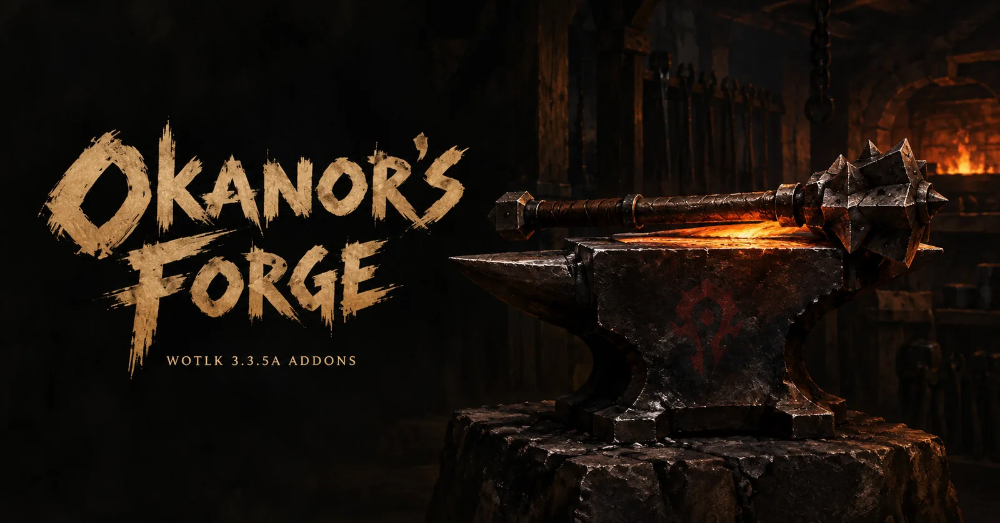
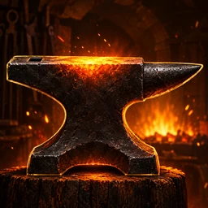
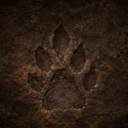
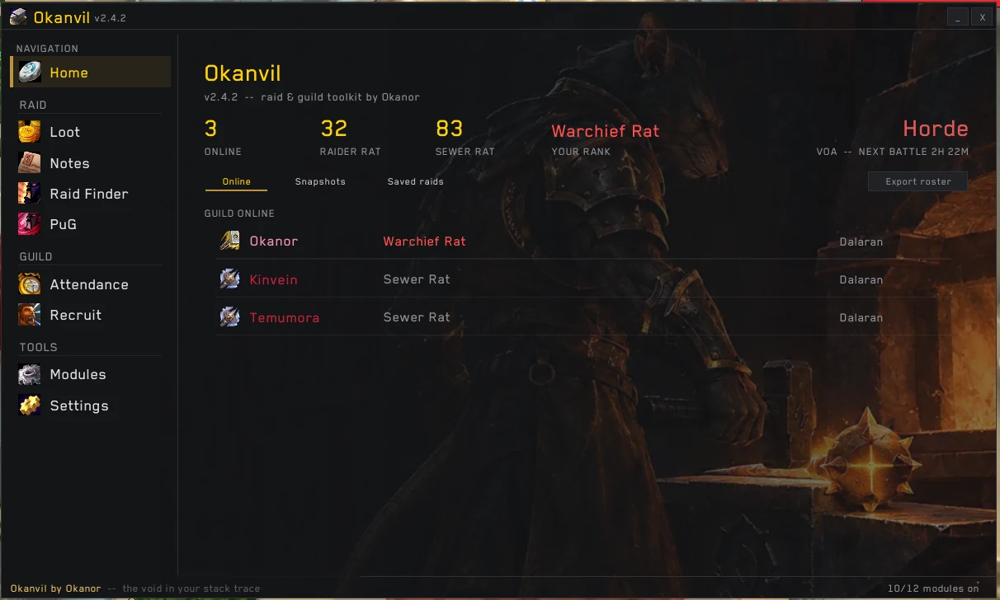
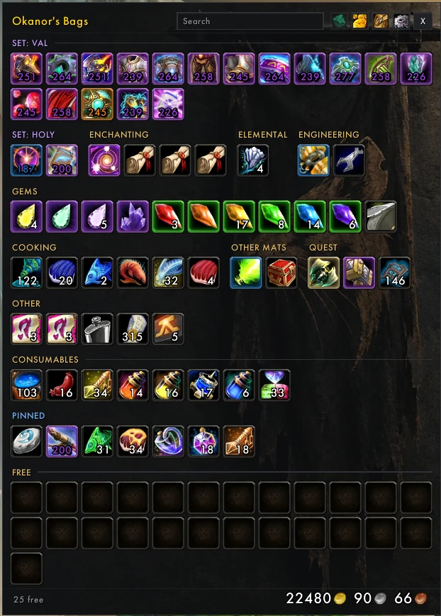

  

  <b>World of Warcraft 3.3.5a addons, forged by Okanor for the RATS guild.</b> 
  Free to play. Screenshots, downloads and everything each addon does, on one site.

  
  &nbsp;
  
  &nbsp;
  
  &nbsp;
  

---

## ⚒️ On the anvil

<table>
<tr>
<td width="72" align="center"></td>
<td>
  <b><a href="https://mrnog.github.io/Okanor-s-Forge/okanvil/">Okanvil</a></b> &nbsp;<code>/okanvil</code> 
  The raid and guild toolkit: loot council, mini roll, snapshots, PuG builder, Raid Finder, raid notes and recruiting, in one window. 
  <a href="https://github.com/MrNog/Okanvil/releases/latest/download/Okanvil.zip">⬇ Download</a> · <a href="https://github.com/MrNog/Okanvil">Source</a>
</td>
</tr>
<tr>
<td width="72" align="center"></td>
<td>
  <b><a href="https://mrnog.github.io/Okanor-s-Forge/ratstash/">RatStash</a></b> &nbsp;<code>/rst</code> &nbsp;in the forge 
  Bags and bank in one window each. Sorted groups that stay put, gear sets together, raid loot kept apart. 
  <a href="https://github.com/MrNog/RatStash-/releases/latest/download/RatStash.zip">⬇ Download</a> · <a href="https://github.com/MrNog/RatStash-">Source</a>
</td>
</tr>
</table>

  
  &nbsp;
  

## 🧰 Install

1. **Download** the addon's `.zip` from its page on the Forge.
2. **Extract** it into `World of Warcraft\Interface\AddOns\`.
3. **Restart** the game.

---

<b>🔨 Working on the site</b>

 

Static HTML and vanilla JS, no build step, served by GitHub Pages from `main` / root.

| Path | What it is |
|:--|:--|
| `index.html` · `forge.css` · `forge.js` | Front page: one banner per addon, from the `ADDONS` array in `forge.js`. `hidden: true` keeps one off the page. |
| `<addon>/index.html` | The addon's full page (`okanvil/`, `ratstash/`, …), sharing `assets/theme.css`, `page.css` and `page.js`. |
| `images/<addon>/` | Its screenshots, as webp. A missing file shows as a dashed box naming the path it expects. |
| `images/art/` · `images/icons/` | Banner, social preview card, site and addon icons. |
| `docs/ART_PROMPTS.md` | Prompts for the art that is still missing. |

**New addon:** copy `ratstash/`, change the text and screenshots, add an entry to `ADDONS`.
**Run locally:** `python -m http.server 8000`, then open http://localhost:8000.

  © 2026 Okanor · All rights reserved. Download and play freely; no copying, changing or re-uploading without permission. 
  World of Warcraft is a trademark of Blizzard Entertainment. These are fan-made addons. 
  Part of the <a href="https://mrnog.github.io/RATS/">RATS</a> guild hub.

